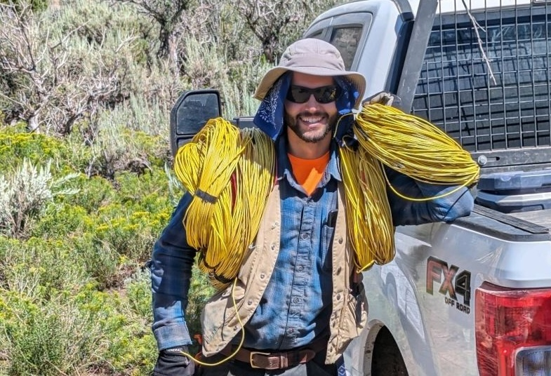
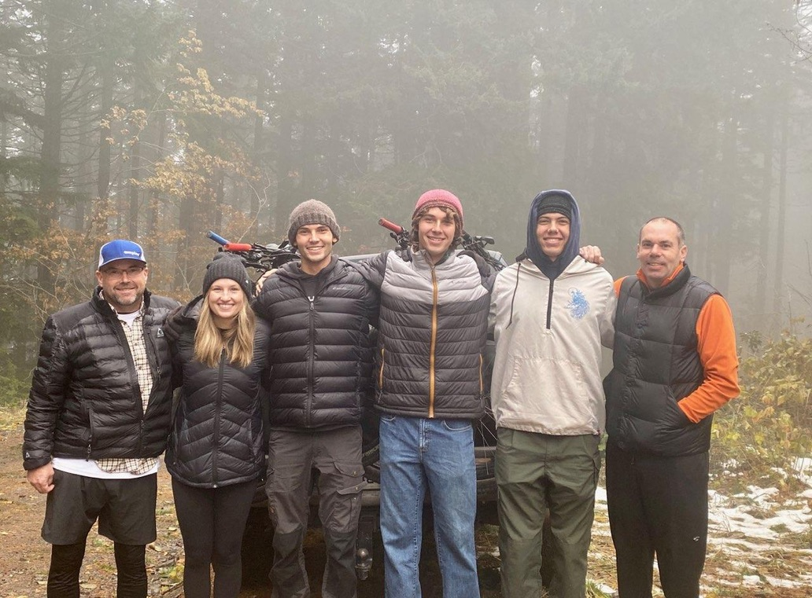

## About the professional me
I am a geoscientist living at the intersection of applied mathematics, computer science, and natural resource exploration. I am passionate about potential field methods, drone geophysics, and computer software. I aspire to explore faster, deeper, and at a larger scale than ever before.

## My research
I study under [Dr. Yaoguo Li & Dr. Mengli Zhang](https://cgem.mines.edu/faculty/) at the [Center of Gravity, Electrical, and Magnetic Studies](https://cgem.mines.edu/) at the Colorado School of Mines. My research is currently focused on regional-scale resource exploration.

## About me
I am a young graduate student with a brief background in drone geophysics. I am fascinated by religion, history, compilers, and the natural world. When I am not at a computer, I am usually at bible study, riding a gravel bike, or walking around campus. I like open-toed shoes, Turkish coffee, shooting the shit, and rap music.

Where can you find me online?
- [The Bible Dojo](https://www.youtube.com/@thebibledojo/streams)
- [The Assembly of the Firstborn](https://www.youtube.com/@assemblyofthefirstborn8360)
- [Mr Blaktastic Channel](https://www.youtube.com/@Blaktastic)
- [Bandcamp](https://bandcamp.com/nate_crummett)
- [LinkedIn](https://www.linkedin.com/in/robert-crummett/)
